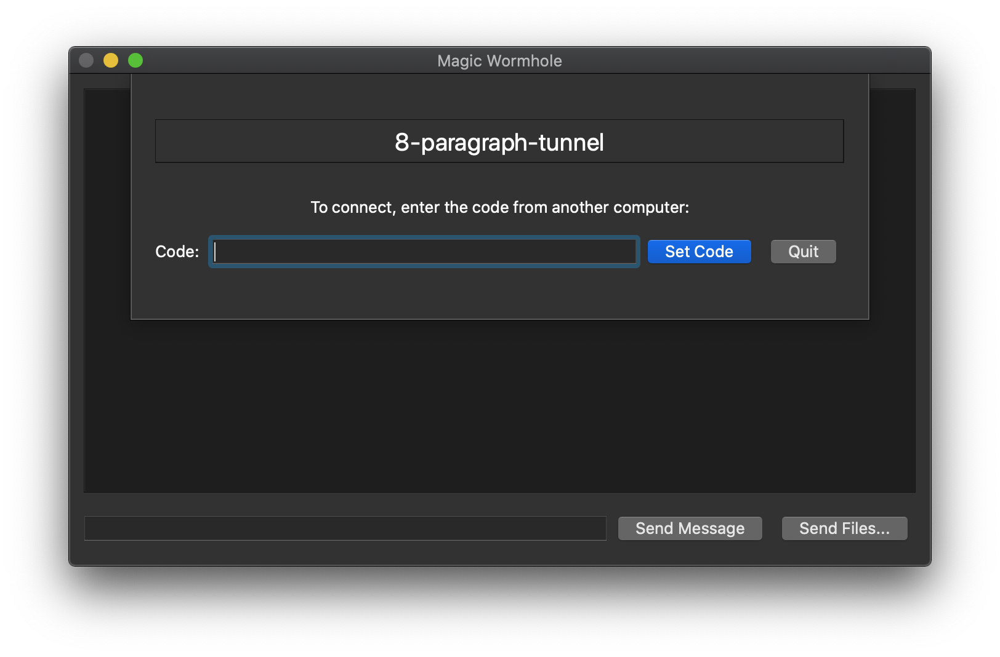

# Magic Wormhole UI

A GUI for the [Magic Wormhole](https://github.com/warner/magic-wormhole/). Get things from one computer to another safely.



[](https://pypi.python.org/pypi/wormhole-ui)
[](https://travis-ci.com/sneakypete81/wormhole-ui)

## Installation

### Windows
Download the [Windows installer](https://github.com/sneakypete81/wormhole-ui/releases/latest/download/Magic.Wormhole.Installer.exe).

### MacOS
Download the [MacOS installer](https://github.com/sneakypete81/wormhole-ui/releases/latest/download/Magic.Wormhole.Installer.dmg).

### Linux
Installer coming soon. In the meantime, see below for installing with pipx.

### From Source
The recommended method to run from the Python source is with [pipx](https://pipxproject.github.io/pipx/):
```sh
  pipx install wormhole-ui
  wormhole-ui
```
(or use pip if you prefer)

## Development

Requires [Poetry](https://poetry.eustace.io/).

```sh
  git clone https://github.com/sneakypete81/wormhole-ui.git
  cd wormhole-ui
  poetry install
```

Then you can use the following:

```sh
  poetry run wormhole-ui  # Run the app
  poetry run pytest       # Run unit tests
  poetry run flake8       # Run the linter
  poetry run black .      # Run the code autoformatter
  poetry run tox          # Run all checks across all supported Python versions
```
